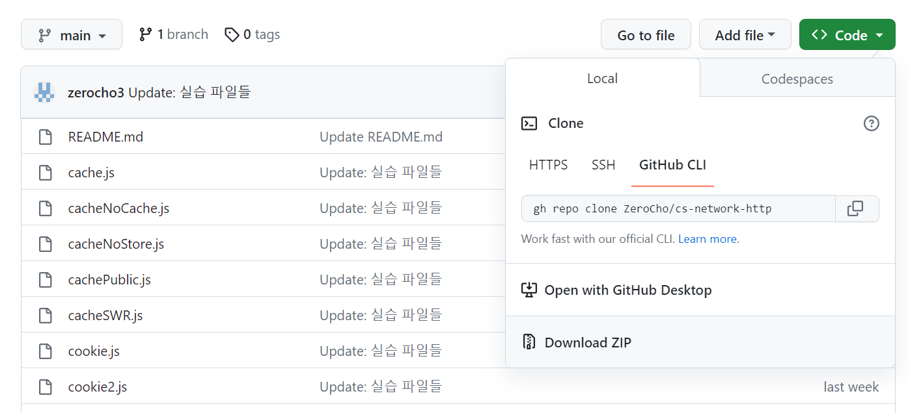
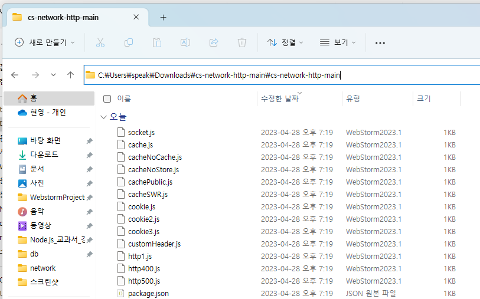
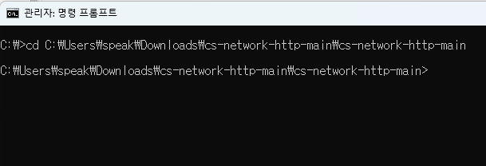
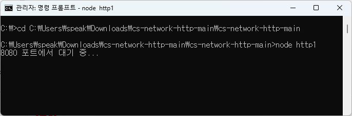

# node.js 설치
1. [링크](https://nodejs.org)
2. LTS 버전 다운로드

# GitHub 소스코드 다운로드 
1. 

Download ZIP 클릭
2. 

압축 풀고 폴더 경로 복사
3. 

터미널을 켜서 **cd 경로** 입력해서 그 폴더로 이동.
추가로 **npm i** 도 한 번 입력(처음 한 번만 하기)

4. 

**node 파일명** 입력해서 서버 실행

참고: 서버를 종료할 때는 **ctrl + c** 눌러서 종료, 서버 내용을 수정할 때도 **ctrl + c** 눌러서 종료 후 **node 파일명**으로 다시 실행해야 수정 내용 반영됨.

